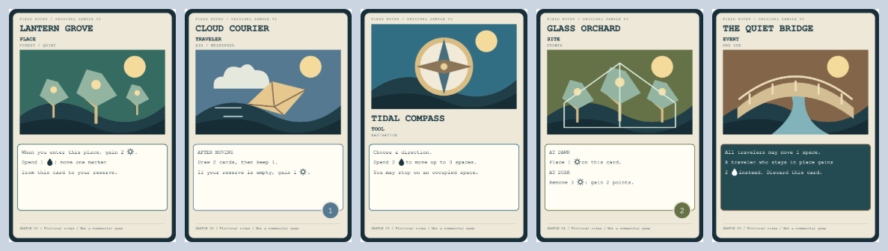
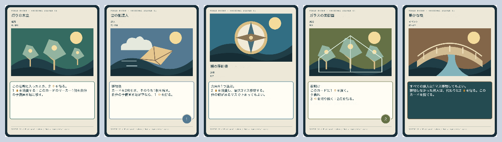

# HappyLocale

HappyLocaleは、カード画像に日本語訳を配置し、画像や印刷用PDFとして書き出せる翻訳支援ツールです。
OCRで原文を読み取り、CSVで訳文をまとめて編集できます。
画像編集・OCRはブラウザ内で行い、カードの編集データはPCのフォルダに保存できます。

重要：本アプリで読み込む画像、PDF、フォント及び成果物等について、適用される法令、ライセンス、利用規約等を利用者自身で確認し、自己の責任で本アプリを利用してください。

PDF翻訳は改善のため一時的に公開を停止しています。カード編集の印刷用PDF出力は引き続き利用できます。

## 主な利用例

- 英語のカード画像から原文を隠し、日本語訳を重ねたPNG／JPEGを作る
- 複数カードの原文と訳文をCSVで往復し、翻訳状況を管理する
- アイコンやフォントをローカルで読み込み、カード間で再利用する

## 画面例

[公開サイトで試す](https://happylifetaka.github.io/happy-locale/)

トップページの「サンプル（デモ）を開く」から、サンプルカード5枚で領域検出・翻訳確認・印刷を試せます。デモではプロジェクト保存はできません。素材の説明は[サンプルカード](samples/cards/README.md)、操作方法は[翻訳の一括確認](docs/user-guide.md#翻訳の一括確認)を参照してください。

**翻訳前**



**翻訳後**



翻訳後は、デモの日本語訳とアセットを使い、アプリと共通の描画処理で生成した出力例です。

## 主な特徴

- **原文を読み取る**：カード画像の英語をOCRで読み取り、翻訳する範囲を選べます。複数カードの領域検出にも対応しています。
- **訳文をまとめて編集する**：カードごとの原文と訳文を一覧で確認でき、CSVへの書き出し・読み込みもできます。用語集や、同じ原文の既存訳を再利用できます。
- **カードの見た目を整える**：原文を隠して日本語訳を配置し、文字のサイズ・フォント・色・縁取りを調整できます。残したい絵柄やアイコンを保護したり、原文の上にルビとして訳を表示したりできます。
- **アイコンを訳文に入れる**：画像からアイコンをアセットとして切り出し、背景を透明にして、複数カードの訳文で使えます。
- **画像や印刷用PDFに書き出す**：編集したカードをPNG／JPEGで保存できます。印刷範囲と実寸を指定し、A4用紙に並べたPDFも作れます。
- **編集を保存して再開する**：複数カードをプロジェクトとしてPCのフォルダに保存できます。操作の取り消し・やり直し、未保存変更の表示、保存時のバックアップにも対応しています。

## ブラウザ内翻訳（試験機能）

「ツール」→「翻訳設定」で「ブラウザ内翻訳」を選ぶと、対応するデスクトップ版Chromeで英日翻訳候補を生成できます。APIキーは不要です。公開版でも利用でき、初回はChromeが翻訳モデルをダウンロードします。原文は端末内で処理します。

一領域の「翻訳候補を取得」、または「翻訳をまとめて確認」から未翻訳の下訳を取得できます。アセットタグを一時識別子へ退避して復元し、破損した候補は停止します。意味・数字・用語は確認が必要です。既存訳は自動で上書きせず、確認して反映するまではプロジェクトを変更しません。詳しくは[利用ガイド](docs/user-guide.md#ブラウザ内翻訳試験機能)をご覧ください。

## プライバシー

通常の画像、PDF、OCR、フォント、CSV、プロジェクト処理で、内容をHappyLocaleの運営サーバーや外部APIへ送信する処理はありません。

- 画像とプロジェクト: ユーザーが明示的に選択したローカルフォルダ
- PDFとCSV: ブラウザのメモリとユーザーが選択した保存先
- OCR: 同一アプリから配信するTesseract Worker、WASM、英語学習データ
- フォント本体: ブラウザのIndexedDB。`project.json`には参照だけを保存
- カード一覧サムネイル: プロジェクトの`thumbnails/`。欠損時に再生成する遅延読込キャッシュ
- 翻訳方式・Translation Endpoint設定: ブラウザの`localStorage`

α機能のTranslation Endpointを選んだ場合だけ、原文テキストと入出力言語をユーザー指定のHTTP(S) Endpointへ送信します。外部URLを指定した場合は外部送信になります。この機能はローカル翻訳モックとのブラウザ結合動作まで確認済みです。HappyLocaleはAPIキーやURL内の認証情報を保持・送信しません。

公開サイト用のビルドでは、外部Translation Endpointへの接続を無効化します。外部接続用の設定・接続確認は表示されず、リクエストも実行しません。デモの翻訳候補は同梱データから取得します。Translation Endpointはローカルで起動するHappyLocaleだけで利用できます。

詳しい保存場所、ランタイムリソース、通信境界は[アーキテクチャ](docs/architecture.md)を参照してください。

## 対応環境

| 機能 | Google Chrome／Chromium | Firefox／Safari |
| --- | --- | --- |
| カードプロジェクト | File System Access APIが必要 | 未対応 |
| フォントファイル選択 | 対応 | 未検証 |
| インストール済みPCフォント | Local Font Access API対応環境 | 未対応 |

カード編集では最初にプロジェクトフォルダを選ぶため、現状の主要フローはGoogle ChromeまたはFile System Access API対応Chromiumブラウザ向けです。Chrome以外は、コード上で機能検出していても動作保証していません。

ローカル開発では`http://localhost`が安全なコンテキストとして扱われます。別ホストへ配置する場合、ブラウザ固有APIの利用にはHTTPSが必要です。

## セットアップ

### miseを使う場合

```bash
mise install
mise exec -- pnpm install --frozen-lockfile
mise exec -- pnpm dev
```

表示されたURL（通常は`http://localhost:3000`）をChromeで開きます。

### miseを使わない場合

次のバージョンを用意してください。

- Node.js 24.15.0以上、25未満
- pnpm 11.21.0

```bash
pnpm install --frozen-lockfile
pnpm dev
```

使用バージョンは`mise.toml`と`package.json`の`packageManager`／`engines`で管理しています。依存関係の再現には`pnpm-lock.yaml`を使用します。

## 基本的な使い方

1. 「プロジェクトを開く」で新規作業用の空フォルダ、または既存の`project.json`を含むフォルダを選びます。
2. 新規作業では、PNG／JPEGを開きます。
3. OCRタブの「領域候補を表示」から領域を自動作成するか、原文部分をドラッグして翻訳領域を作ります。
4. 原文にアイコン(アセット)が含まれる場合は、アセット編集画面で、アイコン(アセット)を登録します。
5. 背景処理を選び、原文と日本語訳、文字設定を編集します。
6. 「プロジェクト保存」で編集データと画像をローカルフォルダへ保存します。
7. 印刷範囲を面付けしたA4 PDFを書き出します。カードごとのPNG／JPEG保存も可能です。

最初にホームで「カード編集を始める」を選びます。詳しい操作、CSV形式、アセット、フォントは[利用ガイド](docs/user-guide.md)を参照してください。

## 開発コマンド

```bash
mise exec -- pnpm test
mise exec -- pnpm typecheck
mise exec -- pnpm lint
mise exec -- pnpm build
```

ESLintは`@antfu/eslint-config`を使用し、Prettierは使用していません。自動修正は`mise exec -- pnpm lint:fix`、watchテストは`mise exec -- pnpm test:watch`で実行できます。

ブラウザ固有機能の確認項目は[`MANUAL_TESTS.md`](docs/MANUAL_TESTS.md)にあります。

静的サイトは `pnpm build:static` で生成・検査します。出力先は `.output/public` です。配置先に応じたURLの指定方法は[静的サイトのビルドと配置](docs/deployment.md)を参照してください。

## 技術構成

- Nuxt 4／Vue 3／Composition API／TypeScript strict
- Canvas API／File System Access API／Local Font Access API／IndexedDB
- Tesseract.js
- PDF.js／pdf-lib
- Vitest／ESLint

コードの責務、永続状態とブラウザリソースの境界、Canvas描画、Undo／Redo、保存形式、CSV照合は[アーキテクチャ](docs/architecture.md)で説明しています。

## 制約と未実装

- メインのカード編集はFile System Access API対応ブラウザが必要
- カード別のUndo／Redo履歴はブラウザの現在セッション内だけ保持する
- 自動背景補修は複雑な塗りつぶしには未対応
- 保護領域とアセット切り出しは矩形を基準とする
- 画像全体のOCR領域候補は試験機能
- Translation Endpoint(翻訳サーバー接続)はα機能で、ローカルで別途翻訳サーバーを建てる必要がある。静的公開版では無効
- PDFの訳文は画像として重ねるため検索・選択できない
- PDFの回転文字、縦書き、複雑な段組み、フォーム等は未対応または未検証
- フォルダ権限をセッションをまたいで復元しない
- 外部の翻訳APIや生成AI等へ直接接続しない。ブラウザ内翻訳はChromeの端末内APIを利用する
- PaddleOCR、AIインペイント、太字は未実装。ルビは領域の原文上へ訳文を一行で配置する方式

計画と完了状況は[機能ロードマップ](docs/ROADMAP.md)、[PDFロードマップ](docs/PDF_TRANSLATION_ROADMAP.md)を参照してください。

## 関連ドキュメント

文書全体の入口は[ドキュメント一覧](docs/README.md)です。

- [利用ガイド](docs/user-guide.md)
- [現在のアーキテクチャ](docs/architecture.md)
- [Pinia移行の設計記録（アーカイブ）](docs/archive/DESIGN.md)
- [開発引き継ぎ](docs/DEVELOPMENT.md)
- [手動回帰確認](docs/MANUAL_TESTS.md)
- [機能ロードマップ](docs/ROADMAP.md)
- [PDF翻訳ロードマップ](docs/PDF_TRANSLATION_ROADMAP.md)
- [コントリビューションガイド](docs/CONTRIBUTING.md)
- [セキュリティポリシー](docs/SECURITY.md)
- [静的サイトのビルドと配置](docs/deployment.md)

## ライセンス

[MIT License](LICENSE)
