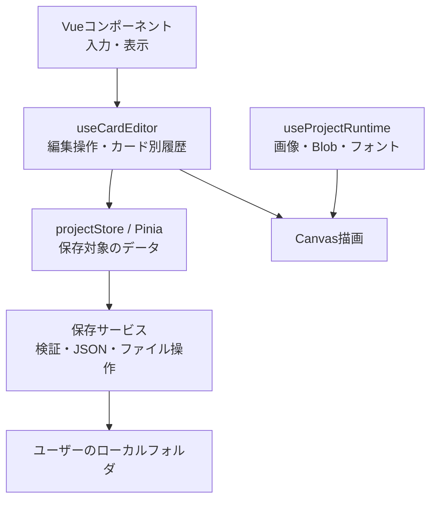

# HappyLocaleのアーキテクチャと実装の考え方

このプロジェクトの設計で一番大切なのは、**「保存するデータ」「操作中の状態」「画像などのブラウザ資源」を分けて、安全に編集できるようにすること**です。VueのComposableとPiniaを使い、その周囲に保存・OCR・描画処理を配置しています。

## 全体の構成



`CardEditor.vue`がこれらをつなぐ調整役です。PDF編集の実装は`app/features/pdf/PdfEditor.vue`を中心に、カード編集とは別の状態・保存形式を持ちます。

| 担当 | 主な実装 | 責務 |
|---|---|---|
| 画面と操作 | `app/components/` | 入力、選択、ダイアログ、プレビュー |
| 編集ロジック | [useCardEditor.ts](../app/composables/useCardEditor.ts) | 領域編集、訳文反映、Undo／Redo |
| 永続データ | [project.ts](../app/stores/project.ts) | 全カードと共有アセット情報の管理 |
| ブラウザ資源 | [useProjectRuntime.ts](../app/composables/useProjectRuntime.ts) | 画像、Blob、フォントの保持と解放 |
| 入出力・外部処理 | `app/services/` | フォルダ保存、PDF、OCR、翻訳 |
| 計算・描画 | `app/utils/` | 座標変換、文字配置、背景補修など |

## 状態を3種類に分ける理由

例えば、一つのアセットにも異なる種類の情報があります。

- **保存する情報**：アセットID、名前、画像の相対パス、表示倍率
- **操作中の情報**：選択中か、切り出し範囲をドラッグしているか
- **ブラウザ資源**：デコードした`ImageBitmap`、保存待ちの`Blob`

これらを分けると、プロジェクトをJSONに保存しやすくなり、Undoのたびに画像本体を複製せずに済みます。画像の解放処理も担当箇所へまとめられます。

共有する際はIDで結びます。保存データの`assetId`を使って、実行中の画像Mapから描画対象を取り出す構造です。

## デザインパターンとしての整理

| パターン・考え方 | このプロジェクトでの使い方 |
|---|---|
| 単方向データフロー | 子コンポーネントが変更をイベントで通知し、編集処理を通して状態を更新する |
| Mementoに近い履歴管理 | 編集状態のスナップショットを保存してUndo／Redoする |
| Strategy／Adapterに近いProvider構造 | OCR・翻訳を共通インターフェースの背後へ置く |
| 計算と副作用の分離 | 座標・CSV照合などの計算と、ファイル操作・画面更新を分ける |
| リソースの所有権の明確化 | 画像やフォントを誰が保持し、いつ解放するかを決める |
| 準備してから反映する処理 | 読み込み・検証が成功してから、現在のプロジェクトを切り替える |

これらは、実装をパターンの言葉で整理したものです。特定の設計体系を全面的に適用しているわけではありません。

## Undo／Redoは「操作前の状態を残す」方式

[useHistory.ts](../app/composables/useHistory.ts)には、現在・過去・やり直し先の状態があります。

```text
過去の状態 ← 現在の状態 → やり直し先
```

変更時に状態を複製し、Undoでは過去のスナップショットへ戻します。カードIDごとに履歴を保持するので、別カードの操作が混ざりません。

この方式は理解しやすく、復元が確実な一方、編集データが大きくなるほど複製コストが増えます。そのため、画像本体を履歴から除外し、履歴件数にも上限を設けています。

また、状態更新は新しいオブジェクトやMapへの置き換えを多用します。過去の状態を誤って書き換えにくくし、`shallowRef`でも変更を追跡できるようにしています。

## OCR・翻訳の差し替え

例えば、OCRには次の契約があります。

```ts
interface OCRProvider {
  recognize: (image: Blob, options?: OCROptions) => Promise<OCRResult>
  dispose?: () => Promise<void>
}
```

Tesseract固有の処理をこの境界の内側へ置くことで、将来別のエンジンを試す際も、呼び出し側の変更を抑えられます。翻訳にも同様の`TranslationProvider`があります。

ただし、画面側には現在の具体的なProviderを生成する処理もあります。差し替えの境界は用意されていますが、全面的な依存性注入までは行っていません。

## 共通の描画経路

カードの編集プレビューと画像出力は、共通の`renderCard`を使います。

```text
元画像 → 背景補修 → 文字・インラインアセットの配置 → 描画
```

これにより、プレビューと出力で文字配置の実装が食い違う可能性を減らします。選択枠などの編集用表示は追加で描画します。

座標変換や文字配置計算には、入力と結果を比較できる関数を用意しています。Canvasへの描画自体には副作用がありますが、計算部分を切り出すことでテストしやすくしています。

## 保存では「どの時点の状態か」を重視する

保存・読み込みの安全性は、次のように確保しています。

- 保存開始時点のデータを書き込む
- 完了時に最新の編集状態を上書きしない
- 実際に保存した内容と現在の内容を比較して、未保存を判定する
- 読み込む画像を先に検証し、成功後に画面の状態を切り替える
- アセット画像を書き込んでから、その参照をJSONへ保存する

複数ファイルを一つのトランザクションとして扱える仕組みではないため、書き込み順序・バックアップ・失敗時の状態保持で安全性を高めています。

## 実装判断の軸

実装判断の軸には、**「ローカル完結」と「人が確認できること」**があります。

画像やフォントは基本的にブラウザとローカルフォルダで扱います。OCR・翻訳結果は候補として提示し、人が確認してから反映します。重い画像処理ライブラリも、効果を確認してから導入する方針です。

現在の課題は、`CardEditor.vue`に調整処理が多く集まっていることと、部品同士をつないだテストがまだ少ないことです。今後分割するなら、保存・読み込みなど責務が明確な処理から切り出し、主要操作のテストと一緒に進めるのが、このプロジェクトの考え方に合っています。

詳しい現状は[アーキテクチャ文書](architecture.md)、状態分離の背景は[DESIGN.md](DESIGN.md)にまとまっています。
