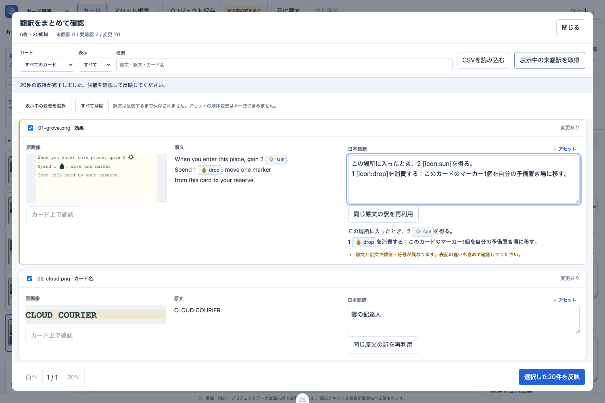

# 翻訳確認プロトタイプ

左側の「まとめて翻訳」で、全カードの原画像・原文・日本語訳を一覧表示します。

自作サンプルを使用した開発時点の画面です。現在のボタン名や警告表示とは一部異なります。

- CSVの読み込み結果も同じ一覧へ取り込み、その場で訳文を編集できます。
- カード、検索語、未翻訳、要確認、変更ありで絞り込めます。20領域ずつ表示します。
- 原文中のアセットは画像付きで表示します。訳文は「＋ アセット」からカーソル位置に挿入でき、画像付きの確認表示も出ます。
- 原文にアセット記法がある場合だけ、名前・個数を比較します。原文にアセット記法がなくても、訳文への登録済みアセットの追加を許容します。未登録アセット、壊れた記法、数値・符号の違いは引き続き確認事項として表示します。アセットの順序は比較しません。
- 同じ原文の既存訳が一種類なら再利用できます。複数の訳がある場合は自動選択しません。
- サンプル翻訳では、左側の「まとめて翻訳」を開いた時点で未翻訳行の候補を取得します。既存訳は保持します。必要に応じて「表示中の未翻訳を取得」から再取得できます。
- CSVの原文差異・重複がある行は初期選択しません。未一致の行は反映しません。
- 未変更の行も選択できます。選択がある場合、候補取得は選択した未翻訳行が対象です。反映は選択した行のうち変更のある訳文だけを下書きにします。未変更行の確認済み状態は変更しません。
- すべての変更を反映すると画面を閉じます。一部だけ反映した場合は未選択の編集を保持し、画面を開いたままにします。「カード上で確認」から対象の領域へ移動することもできます。

## 現段階の範囲

CSVと直接編集は通常プロジェクトでも利用できます。画面内の自動候補取得はサンプル翻訳プロバイダーに対応しています。通常のTranslation Endpointは既存の個別送信確認フローを使用します。

原文の編集、OCR候補の結合、文字のはみ出し検出、印刷前チェックの集約はまだ含めていません。アセット・数字の比較は確認を助けるためのもので、訳の意味の正しさを判定するものではありません。

編集中の訳文はメモリー内に保持されます。「反映」後の変更をファイルへ残すには、既存の「プロジェクト保存」を使用します。デモではプロジェクト保存は無効です。

## 共通処理

`translation-review.ts` が行の作成、CSV照合結果の取り込み、確認事項、反映直前の原文・訳文照合を担当します。CSVとデモの候補は同じ行モデルに入り、既存のCSV照合とプロジェクト反映処理を共有します。
